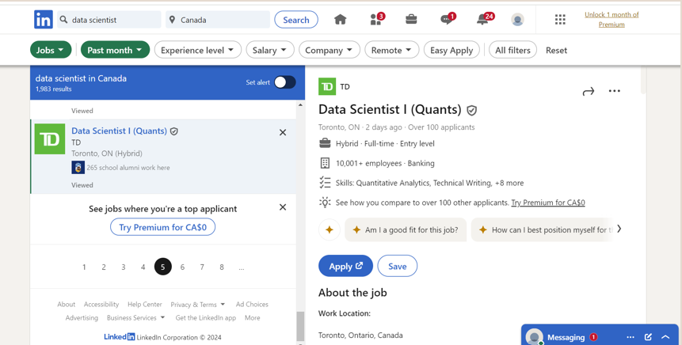
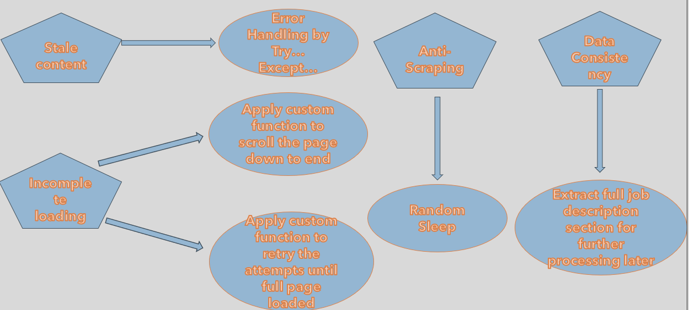
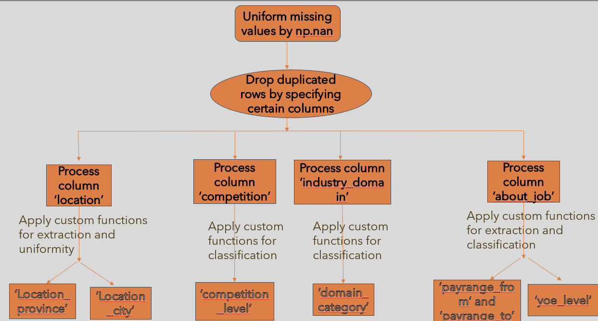
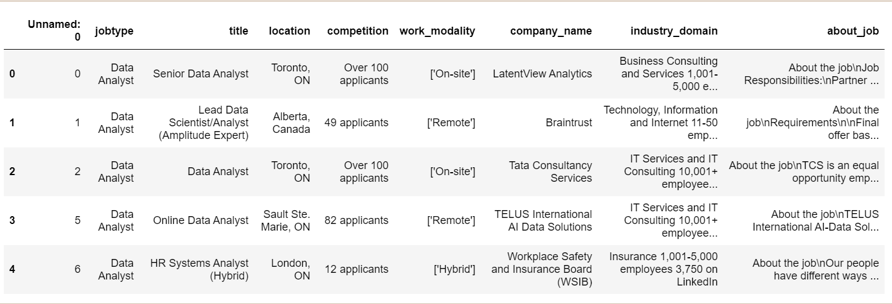
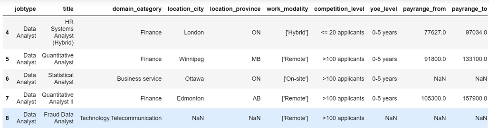
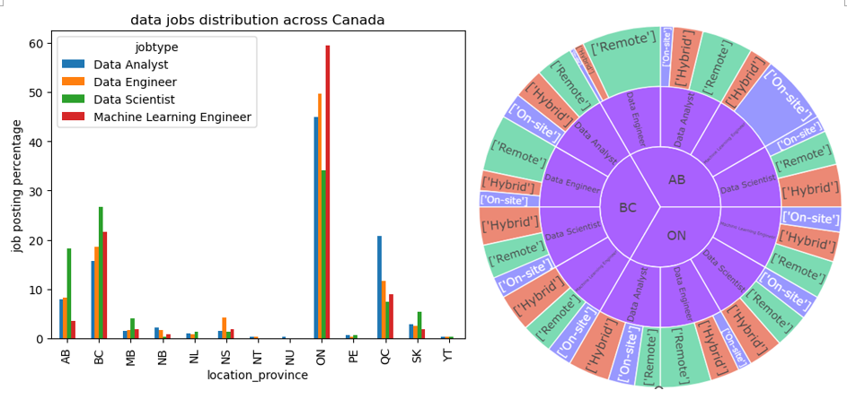
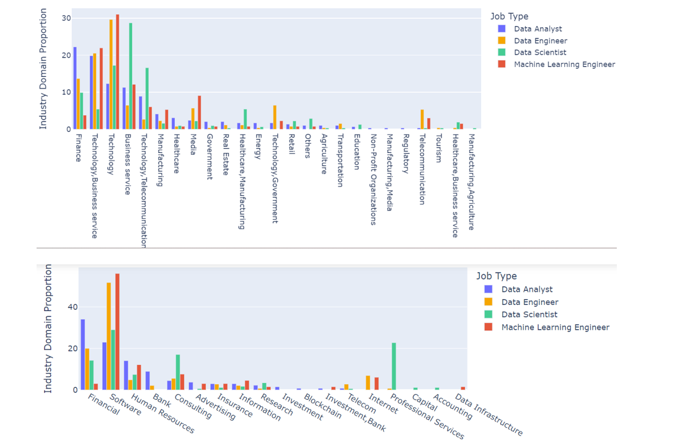
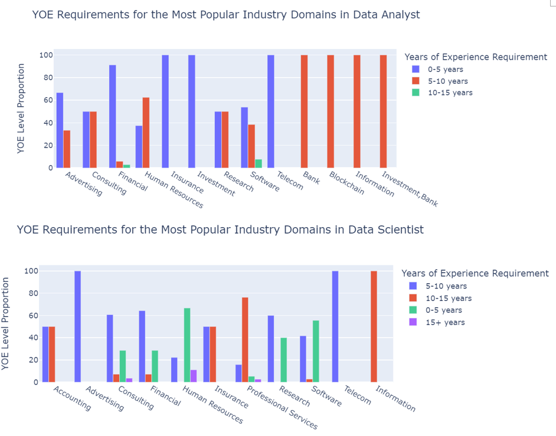
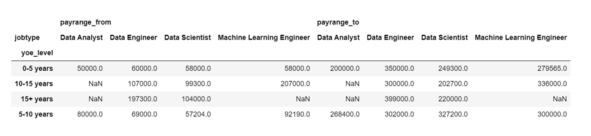

# LinkedIn-Job-Search-Web-Scraping-and-Market-Analysis
## Motivation
As I transition into a career in data, understanding the job market is crucial. This project aims to extract insights from LinkedIn to answer the following key questions:
- Location: Where are data jobs concentrated in Canada?
- Remote Opportunities: What are the chances of securing a remote role outside Winnipeg?
- Industry Demand: Which industries have the highest demand for data professionals?
- Experience Requirements: How prevalent are entry-level opportunities in the data field?
- Compensation: What are the salary ranges across different levels and roles?
LinkedIn, as a premier job search platform, offers the necessary data to explore these questions through advanced web scraping techniques.

## Scraped Page Outlook (2024 July)

- Left Panel: Lists job titles with brief introductions.
- Right Panel: Displays detailed job descriptions upon clicking a title.

## Methodology
### 1. Data Gathering
Challenges:
- Dynamic Content Loading:
  - LinkedIn jobs load dynamically, requiring scrolling and real-time content retrieval.
  - Content becomes stale quickly.
- Data Consistency:
  - Variations in how job listings are formatted by users.
- Anti-Scraping Mechanisms:
  - CAPTCHAs, IP blocking, or rate-limiting mechanisms.

Solutions:
To address these challenges, the following workflow was implemented:

### 2. Data Cleaning and Processing
Challenges:
- Duplicate Records: Multiple entries for the same job listing.
- Inconsistent Missing Values: Missing values appear as empty strings or lists.
- Non-Uniform Locations: Varying formats for the location field.
- Applicant Numbers and Industry Domains: Highly varied formats and values.
- Verbose "About the Job" Section: Excessive text needing standardization.
Solutions:
A robust processing pipeline was designed to address these challenges:

## Key Highlights
- Advanced Web Scraping:
  - Developed a robust pipeline to collect job data from LinkedIn, including job titles, company names, locations, number of applicants, work modalities, and detailed descriptions.
  - Overcame challenges like dynamic content loading, data inconsistencies, and anti-scraping measures.
- Data Preparation:
  - Designed a comprehensive processing pipeline to process raw data into a structured format, enabling seamless analysis:
    - **raw data**
       
    - **processed data**
          
- Exploratory Data Analysis (EDA):
  - Performed in-depth analysis to uncover key trends in the job market.
- Market Insights:
  - Identified key patterns in job distribution, remote opportunities, industry demands, experience requirements, and salary ranges.
## Results
### Location amd Work Modality Analysis

- High demand for data roles is concentrated in Ontario (ON), British Columbia (BC), Quebec (QC), and Alberta (AB).
- Remote positions for Data Analysts and Data Scientists account for ~33% of the market in these provinces.
### Industry Domain Analysis

- Data-related jobs are predominantly found in Finance, Technology, Business Services, and Telecommunications.
- The second plot displays the data jobs distribution in specific subdomains from the four most popular domain categories.
### Years of Experience (YOE) Analysis

- Intermediate-to-senior-level roles dominate the market for Data Analysts across most domains.
- Entry-level roles for Data Scientists are more prominent in Human Resources, software, and research sectors.
### Salary Amalysis

- Salaries for data roles range widely, from $50,000 to $400,000 annually.
- For Intermediate-to-senior-level Data Analyst roles: Salaries range from $80,000 to $270,000 annually.
- For Entry-level Data Scientist roles: Salaries range from $60,000 to $250,000 annually.

## Conclusion
This project successfully extracted, cleaned, and analyzed LinkedIn job data to provide actionable insights into the Canadian data job market. By identifying trends in job distribution, work modalities, industry demands, experience levels, and compensation, it offers valuable guidance for data professionals navigating their careers.

